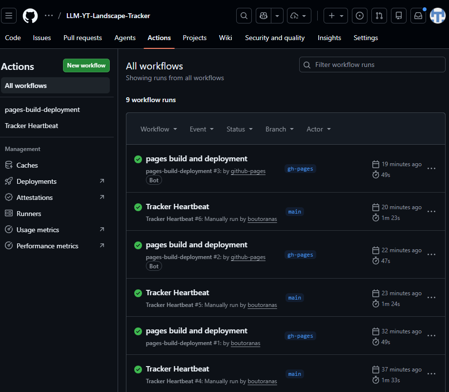

# LLM YouTube Landscape Tracker — Assessment Report

This repository contains the code and materials for the LLM YouTube Landscape Tracker assessment. The live site hosts an automatically-updated table that summarizes recent AI/LLM-related YouTube videos from selected creators.

**Live site**: https://boutoranas.github.io/LLM-YT-Landscape-Tracker/

**Repository**: https://github.com/boutoranas/LLM-YT-Landscape-Tracker/

**Problem Statement**
The goal is to track recent LLM-related YouTube videos, extract transcripts when available, and produce short structured summaries and topic tags that help reviewers quickly understand new developments in the LLM landscape.

**Methodology**
- Data collection: channel metadata is stored in `dataset/channels.json` as `{ "url", "channel_id" }` entries. The tracker uses the YouTube RSS feed for each channel ID first, which avoids fragile scraping of the `/videos` tab. If RSS fails, it can still fall back to `yt_dlp`.
- Request stability: outbound fetches use a rotating User-Agent (`fake-useragent`) and can optionally be routed through a proxy via the `PROXY_URL` secret/environment variable.
- Transcripts: `youtube-transcript-api` requests auto-captions or uploaded captions for each video; if none are available the script records a placeholder.
- Summarization / analysis: the script calls Google GenAI (Vertex) via the `google-genai` client to produce a JSON analysis containing `topics`, `summary`, and `relationship` for each video.
- Storage & hosting: results are appended/updated in `data.json`. A GitHub Actions workflow (`.github/workflows/heartbeat.yml`) runs the tracker on a schedule, writes `service_account.json` from the `SERVICE_ACCOUNT_JSON` secret, and publishes `index.html` + `data.json` to the `gh-pages` branch for GitHub Pages hosting.

**Evaluation Dataset**
- The (generated) dataset is `data.json` and contains records with these fields:
  - `id`: YouTube video id
  - `speaker`: channel or uploader name
  - `title`: video title
  - `url`: watch URL (https://youtu.be/<id>)
  - `transcript`: full transcript or placeholder
  - `topics`: list of inferred topics
  - `summary`: 1–2 sentence summary
  - `relationship`: short note linking the video to broader LLM developments

- If you want to submit a stable evaluation dataset, save a snapshot of `data.json` and include it in the repo or as an artifact in the submission (recommended: keep it small and anonymized where necessary).

**Dataset (repository files)**

- `dataset/channels.json`: list of channels the tracker polls. Each entry stores the public channel URL and the corresponding `channel_id` used for RSS discovery.
- `data.json`: generated by the tracker at runtime; contains the analysis records described above. The `gh-pages` branch stores the current public copy used by the live site.

You should include a small snapshot of `data.json` in the repo for review (e.g., `data-snapshot.json`) if you want reviewers to inspect a fixed dataset without running the workflow.

**Evaluation Methods**
- Human evaluation: manually verify a random sample of N summaries against transcripts and rate correctness (e.g., correct / partially correct / incorrect).
- Coverage: compute fraction of videos with available transcripts vs. total attempted.
- Consistency: check whether topic lists match keywords extracted from titles/transcripts.

Include short instructions to record evaluation results (a CSV or table): columns: `video_id`, `rater`, `correctness`, `comments`.

**Limitations**

- YouTube may rate-limit or block requests from GitHub-hosted runners or other cloud IPs. When that happens, RSS or transcript fetches can fail even if the code is correct.
- In practice, GitHub Actions can be blocked even when local runs work, especially during transcript fetches. A fix to this would be to work with a proxy URL.
- Some videos have no transcripts, no auto-captions, or captions that are not exposed through the transcript API. In those cases the tracker records a placeholder and the summary is title-based.
- `yt-dlp`, transcript extraction, and YouTube page formats can change over time. If YouTube alters its internal structure, the fallback paths may need maintenance.
- The live site depends on the latest successful GitHub Actions run and the `gh-pages` branch. If the workflow fails, the published table can lag behind the newest data.
- A proxy can improve reliability, but it is not guaranteed to bypass all YouTube protections or transcript restrictions.

**Experimental Results (example template)**
Provide a short summary of results here and include concrete numbers. Replace the placeholders below before submission:

- Total videos processed: 8
- Videos with transcript: 5/8 when ran on github actions but 7/8 when ran locally
- Videos summarized successfully: 8 (summarized successfully including those using title only, but only 5 if we consider only those with a available transcript)
- Average summary quality (human-rated): N/A

**Workflow Run Evidence**

*Screenshot of GitHub Actions showing successful "Tracker Heartbeat" and "pages build and deployment" runs.*

**Evaluation — sample outputs**

Below is a sample of the table produced by the tracker (these rows were generated during the most recent run):

https://boutoranas.github.io/LLM-YT-Landscape-Tracker/

